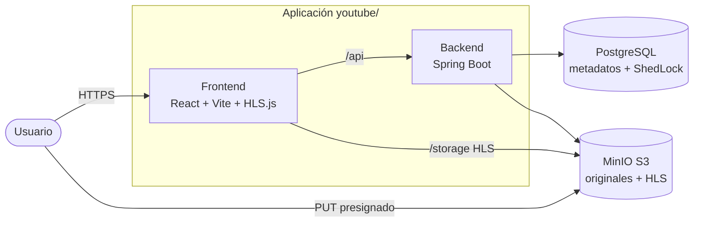
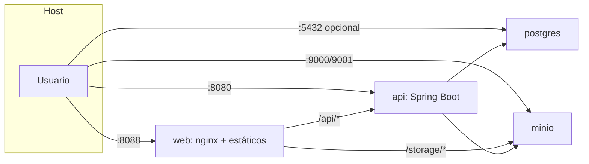
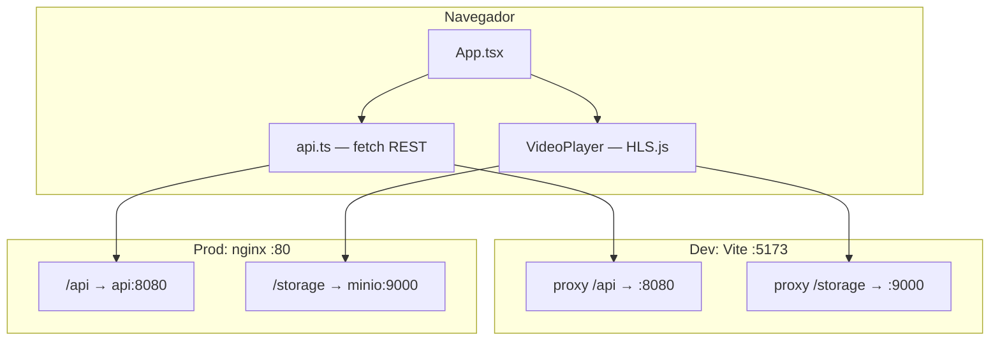
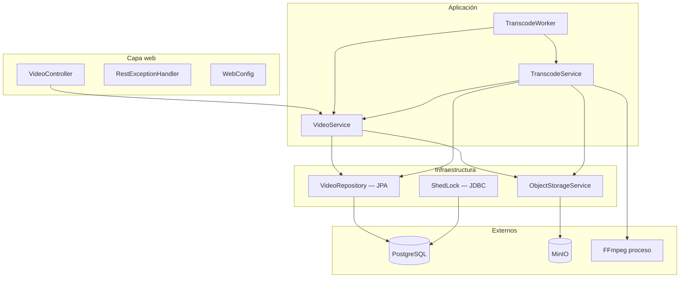
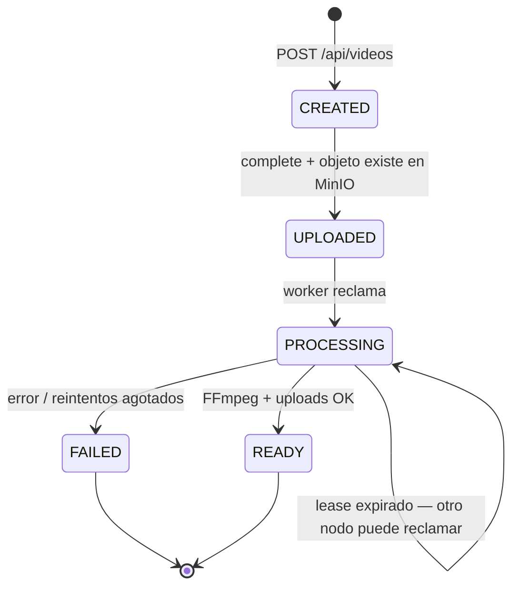
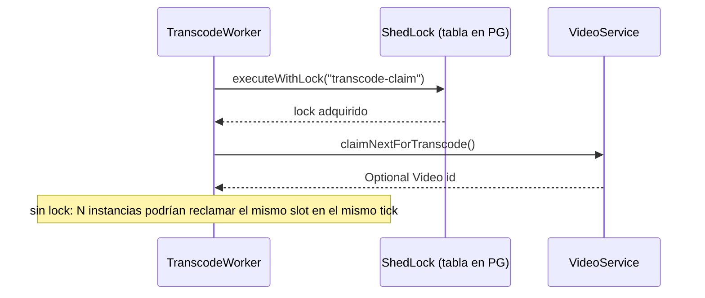
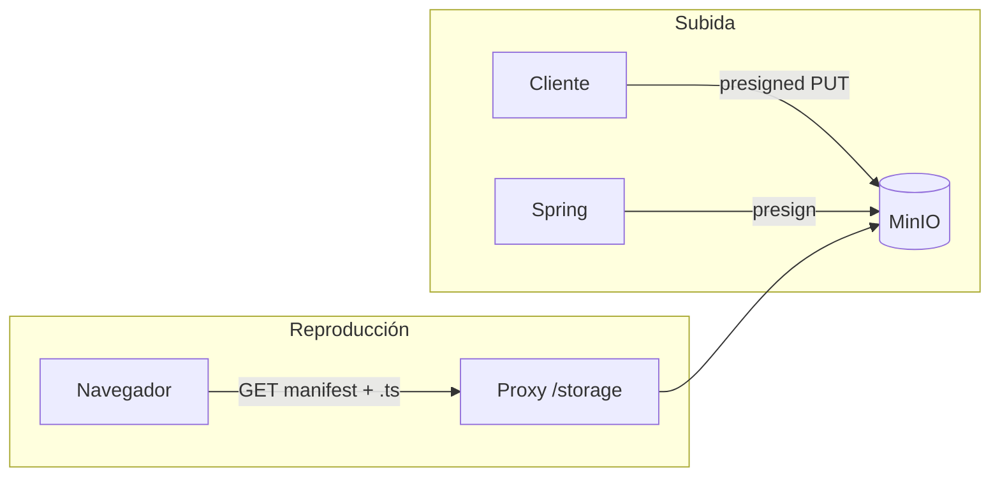
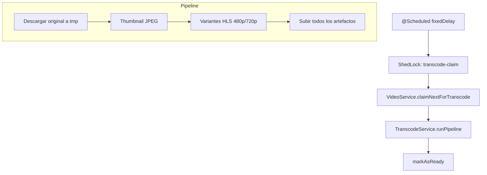
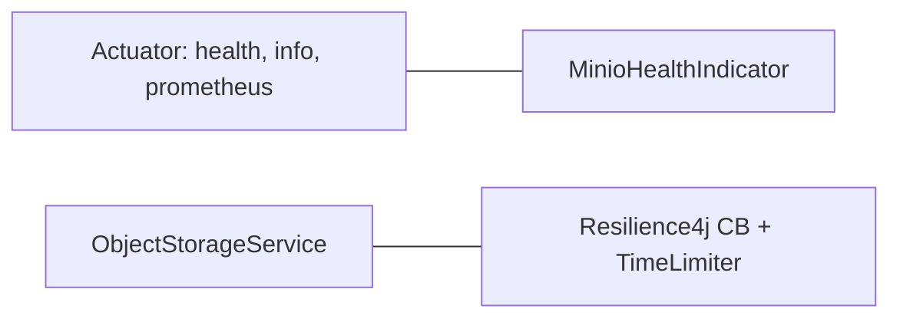

# Diseño del sistema (plataforma de video)

Documento de arquitectura de la iteración actual: subida directa a almacenamiento compatible S3, metadatos en PostgreSQL, transcodificación HLS con FFmpeg en el mismo proceso API, frontend SPA servido por nginx (producción) o Vite (desarrollo).

**No hay Redis** en esta versión: la cola de trabajo es el propio estado en PostgreSQL más un scheduler en Spring; la coordinación entre réplicas del API usa **ShedLock** sobre JDBC (tabla en Postgres), no un broker in-memory.

---

## 1. Vista de contexto

### Decisiones

| Decisión | Por qué este camino | Alternativas y trade-offs |
|----------|---------------------|---------------------------|
| SPA + API REST | Encaja con MVP, equipos separados front/back, contrato HTTP claro. | **BFF / GraphQL**: menos round-trips pero más acoplamiento y superficie de API; **Server-driven UI**: poco habitual para video. |
| MinIO local / S3-compatible | Mismo modelo que producción en nube sin vendor lock-in del código (SDK S3). | **Filesystem local**: más simple en dev pero URLs y permisos distintos a prod; **Blob propietario**: menos portable. |

---

## 2. Despliegue (Docker Compose)

- **`APP_PLAYBACK_BASE_URL`** apunta al origen desde el que el cliente puede resolver HLS (p. ej. `http://localhost:8088/storage`) para que `manifestUrl` sea coherente con el proxy de nginx.
- El contenedor **web** no depende de MinIO en `depends_on` (el backend sí de Postgres); nginx habla a MinIO por red interna cuando el usuario pide segmentos.

### Decisiones

| Decisión | Por qué | Trade-offs |
|----------|---------|------------|
| nginx delante del front en prod | Sirve estáticos, gzip, `try_files` para SPA, un solo origen para `/api` y `/storage` (menos CORS). | **Solo Vite en prod**: no recomendable; **CDN + API gateway**: más piezas. |
| Postgres 16 Alpine | Imagen ligera, healthcheck para arrancar API después. | **SQLite**: no escala a múltiples instancias API con locks distribuidos como ShedLock sin otro mecanismo. |

---

## 3. Frontend (`frontend/`)

- Flujo de subida: `POST /api/videos` → `PUT` al `uploadUrl` presignado (sale del navegador hacia MinIO) → `POST /api/videos/{id}/complete`.
- `uploaderId` se genera en `localStorage` para poder borrar solo “los míos” (`DELETE` con query param); no hay sesión servidor.

### Decisiones

| Decisión | Por qué | Trade-offs |
|----------|---------|------------|
| Proxy `/storage` (Vite/nginx) | El manifest y los `.ts` se sirven mismo origen que la app → evita CORS en HLS. | **CORS en MinIO**: posible pero más configuración y superficie; **URLs firmadas solo**: más lógica de expiración en cliente. |
| HLS.js | Safari tiene HLS nativo; otros navegadores necesitan MSE. | **DASH**: otro empaquetado y tooling; **progressive MP4**: sin adaptive bitrate sin lógica extra. |

---

## 4. Backend — capas lógicas

### Decisiones

| Decisión | Por qué | Trade-offs |
|----------|---------|------------|
| Spring Boot monolito | Un solo deploy, transacciones locales, scheduler + REST en un JVM. | **Microservicios video/API**: aislamiento de carga FFmpeg pero más red, despliegue y consistencia; **Lambda + cola**: escalado fino, cold starts y límites de tiempo. |
| `ddl-auto: validate` | Esquema explícito (migraciones implícitas vía convención del proyecto / tests). | **`update` en dev**: rápido pero frágil en equipo. |

---

## 5. Datos y estados (PostgreSQL)

- **Pessimistic lock** al elegir el siguiente `UPLOADED` y al buscar `PROCESSING` “stale” (lease vencido) para recuperación.
- **`processing_lease_until`**: evita que dos workers procesen el mismo video indefinidamente; se renueva durante FFmpeg.

### ShedLock (no Redis)

| Decisión | Por qué | Trade-offs |
|----------|---------|------------|
| Cola = filas `videos` + scheduler | Sin componente extra; operación y backup unificados con el dominio. | **Redis / SQS / RabbitMQ**: mejor throughput y desacople CPU API vs worker, pero más infra y operación; **Redis Streams**: muy válido si el volumen de jobs crece. |
| ShedLock en JDBC | Misma base que ya es obligatoria; evita “double claim” al escalar API horizontalmente. | **Lock solo en memoria**: no sirve con >1 réplica; **advisory locks PG sin ShedLock**: posible pero reinventar TTL y nombres. |

---

## 6. Almacenamiento de objetos (MinIO / S3)

- Claves: `originals/{id}/source`, `transcoded/{id}/...` (thumbnail, variantes HLS, `master.m3u8`).
- **Resilience4j** (circuit breaker + time limiter) envuelve llamadas MinIO en `ObjectStorageService`.
- Política de lectura pública en prefijo `transcoded/*` (documentado en README; aplicación al arranque en código de configuración MinIO).

| Decisión | Por qué | Trade-offs |
|----------|---------|------------|
| Presigned PUT | El archivo grande no pasa por el JVM del API; menos memoria y timeout HTTP. | **Upload multipart vía API**: más control pero cuello de botella y límites de tamaño en proxy. |
| `playback-base-url` configurable | URLs en playlists deben ser alcanzables por el cliente (puerto/proxy distintos en dev/docker). | **URLs relativas en m3u8**: requiere que el reproductor resuelva base correctamente según dónde se sirva el manifest. |

---

## 7. Transcodificación (FFmpeg + worker)

- FFmpeg se invoca por proceso; timeouts configurables en `application.yml`.
- **No** es HLS “live”: el estado pasa a `READY` cuando terminó todo el pipeline (ver README).

| Decisión | Por qué | Trade-offs |
|----------|---------|------------|
| FFmpeg externo | Estándar de industria, códec y HLS bien probados. | **Servicios managed transcode** (MediaConvert, etc.): menos ops, costo y acoplamiento al proveedor. |
| Worker en el mismo proceso que REST | Simplicidad operativa para MVP. | Bajo pico de uploads + transcodes, la API compite por CPU; **worker dedicado** o **cola** escala mejor. |
| Reintentos con backoff en `TranscodeWorker` | Fallos transitorios (red, MinIO). | Sin idempotencia perfecta en todos los bordes podría haber duplicados de objetos parciales si no se limpia prefijo; el diseño actual asume re-ejecución controlada. |

---

## 8. Observabilidad y resiliencia

| Decisión | Por qué | Trade-offs |
|----------|---------|------------|
| Prometheus en Actuator | Métricas estándar para Grafana sin librería custom. | Expuesto sin auth en config actual → solo redes de confianza. |
| Health agregado (DB + MinIO) | Kubernetes/orquestadores pueden usar probes. | Health “profundo” puede marcar DOWN por dependencia lenta; a veces se separa *liveness* vs *readiness*. |

---

## 9. Seguridad (alcance actual)

- Sin autenticación de usuarios finales: `uploaderId` es un string opaco en query param.
- Presigned URLs con TTL acotado (`app.presign-ttl-seconds`).

| Decisión | Por qué | Trade-offs |
|----------|---------|------------|
| MVP sin auth | Velocidad de entrega del flujo video. | **OAuth2 / API keys**: necesario antes de exposición pública real. |

---

## 10. Resumen: Redis y otras piezas “que no están”

| Componente | Estado en el repo | Si se añadiera |
|------------|-------------------|----------------|
| **Redis** | No usado | Cache de listados, rate limit, cola de jobs, pub/sub de progreso; coste: otro servicio HA y consistencia con DB. |
| **Message broker** | No usado | Desacoplar transcode del API; coste: entrega at-least-once, idempotencia, dead-letter. |
| **CDN** | No | Menor latencia HLS global; coste: invalidación y configuración de orígenes. |

Este documento refleja el código y `docker-compose` en el momento de su redacción; si se incorporan colas, workers separados o Redis, conviene actualizar los diagramas y la sección de trade-offs en consecuencia.
