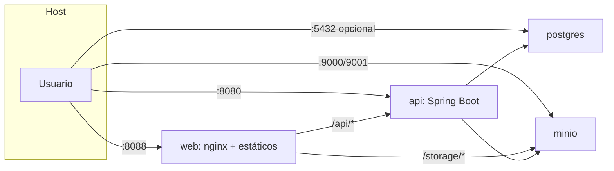
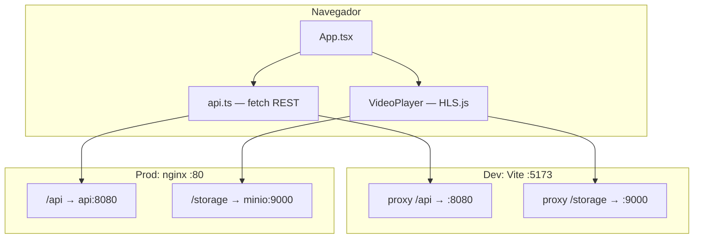
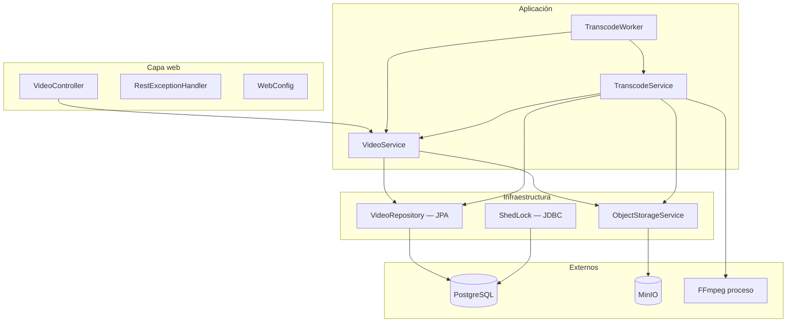
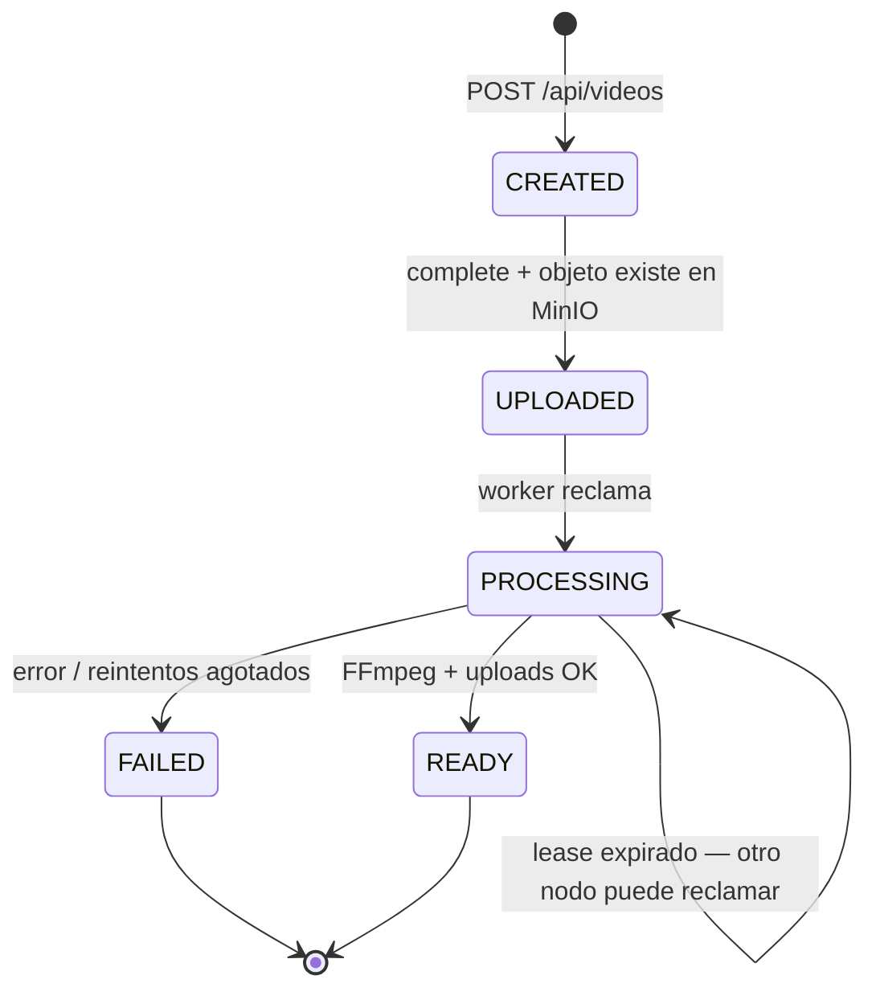
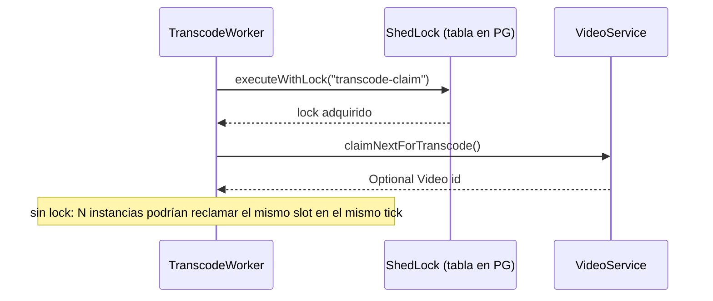
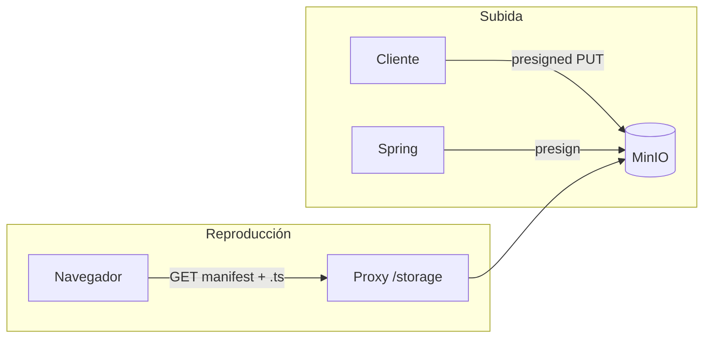
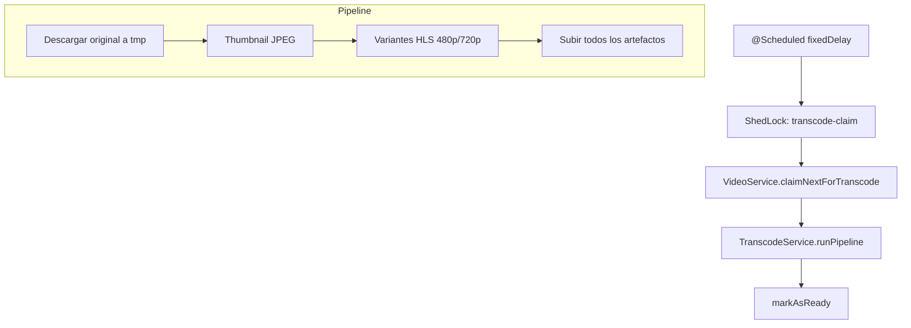
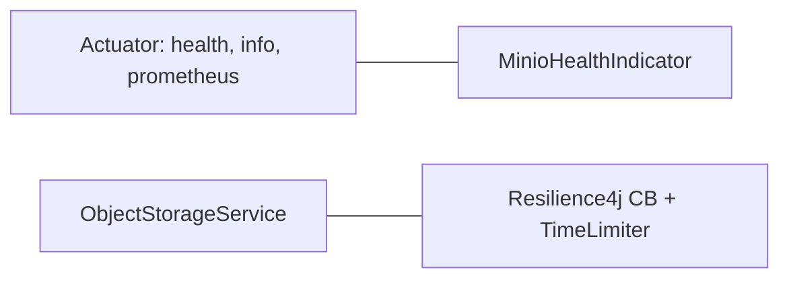

# Diseño del sistema (plataforma de video)

Documento de arquitectura de la iteración actual: subida directa a almacenamiento compatible S3, metadatos en PostgreSQL, transcodificación HLS con FFmpeg en el mismo proceso API, frontend SPA servido por nginx (producción) o Vite (desarrollo).

**No hay Redis** en esta versión: la cola de trabajo es el propio estado en PostgreSQL más un scheduler en Spring; la coordinación entre réplicas del API usa **ShedLock** sobre JDBC (tabla en Postgres), no un broker in-memory.

---

## 1. Vista de contexto

### Decisiones

#### Categoría: Arquitectura front y back (modelo de aplicación)

| Opción | Ventajas | Desventajas |
|--------|----------|-------------|
| **SPA + API REST** | Contrato HTTP claro; equipos front/back desacoplados; fácil de versionar y testear el API. | Más round-trips que un BFF agregador; el cliente orquesta el flujo (crear → subir → completar). |
| **BFF / GraphQL** | Menos viajes de red; la capa intermedia puede adaptar payloads al UI. | Más superficie y acoplamiento front–“middle”; más lógica duplicada o a medio camino respecto al dominio. |
| **UI server-driven (HTMX, etc.)** | Menos JS en cliente para formularios simples. | Poco alineado con reproductor HLS, subidas grandes y estado rico en el navegador. |
| **Event-driven en el cliente (p. ej. SSE / WebSocket + poco REST)** | El servidor empuja cambios de estado (p. ej. transcode listo) sin polling; UX más reactiva. | Conexiones largas, timeouts en proxies/CDN, reconexión y modelo de sesión; más superficie que request/response puro. |

**Decisión final:** SPA (React + Vite) consumiendo REST JSON.

**Justificación:** Para un MVP de video el contrato REST es suficiente y estable; el cliente ya debe manejar archivos grandes, presign y polling sin que el servidor renderice páginas.

#### Categoría: Integración con almacenamiento (contexto)

| Opción | Ventajas | Desventajas |
|--------|----------|-------------|
| **MinIO / API compatible S3** | Mismo modelo que nubes públicas; SDK y patrones (presign, buckets) reutilizables. | Operar MinIO (credenciales, políticas, disco); en dev hay más moving parts que un directorio local. |
| **Filesystem local** | Máxima simplicidad en una máquina. | URLs, permisos y despliegue no se parecen a prod; subidas directas desde el navegador suelen forzar el tráfico por el API. |
| **Blob propietario del proveedor** | Servicio gestionado con SLA. | Vendor lock-in de API y tooling; el código de este repo prioriza portabilidad vía S3. |

**Decisión final:** MinIO (en Docker) como backend S3-compatible.

**Justificación:** Se mantiene el mismo patrón de producción (presign, claves, políticas) sin acoplarse a un vendor concreto en el código de aplicación.

---

## 2. Despliegue (Docker Compose)

- **`APP_PLAYBACK_BASE_URL`** apunta al origen desde el que el cliente puede resolver HLS (p. ej. `http://localhost:8088/storage`) para que `manifestUrl` sea coherente con el proxy de nginx.
- El contenedor **web** no depende de MinIO en `depends_on` (el backend sí de Postgres); nginx habla a MinIO por red interna cuando el usuario pide segmentos.

### Decisiones

#### Categoría: Despliegue y borde (reverse proxy / contenedores)

| Opción | Ventajas | Desventajas |
|--------|----------|-------------|
| **nginx sirviendo estáticos + proxy a API y MinIO** | Un solo origen para UI, `/api` y `/storage`; gzip; `try_files` para SPA; menos dolores de CORS en HLS. | Hay que mantener `nginx.conf` y coherencia de rutas con Vite en dev. |
| **Solo Vite `preview` en producción** | Menos archivos de infra. | No es el rol de Vite; peor rendimiento y operación para estáticos y TLS delante. |
| **CDN + API Gateway separados** | Escala global y políticas centralizadas. | Más piezas, coste y complejidad para un MVP. |

**Decisión final:** Imagen Docker del frontend basada en nginx con `location /api/` y `/storage/`.

**Justificación:** Un solo host:puerto para el usuario simplifica `playback-base-url` y evita configurar CORS en MinIO para segmentos HLS.

#### Categoría: Base de datos en contenedor

| Opción | Ventajas | Desventajas |
|--------|----------|-------------|
| **PostgreSQL 16 Alpine + healthcheck** | Imagen pequeña; `depends_on` con condición de salud para levantar el API cuando la DB está lista. | Alpine a veces sorprende con librerías nativas (no crítico aquí con JDBC puro). |
| **SQLite** | Cero servicio aparte en dev. | Varias instancias del API + ShedLock / locks distribuidos no encajan sin otro mecanismo de coordinación. |
| **Postgres “full” no-Alpine** | Máxima compatibilidad binaria. | Imagen más pesada sin beneficio claro para este alcance. |

**Decisión final:** PostgreSQL 16 Alpine en `docker-compose`.

**Justificación:** El backend ya asume Postgres para JPA y para ShedLock; el healthcheck reduce fallos de arranque por carrera con la API.

---

## 3. Frontend (`frontend/`)

- Flujo de subida: `POST /api/videos` → `PUT` al `uploadUrl` presignado (sale del navegador hacia MinIO) → `POST /api/videos/{id}/complete`.
- `uploaderId` se genera en `localStorage` para poder borrar solo “los míos” (`DELETE` con query param); no hay sesión servidor.

### Decisiones

#### Categoría: Arquitectura frontend (red y reproducción)

| Opción | Ventajas | Desventajas |
|--------|----------|-------------|
| **Proxy `/storage` (Vite en dev, nginx en prod)** | Mismo origen que la app para manifest y `.ts`; el navegador trata HLS como same-origin. | El proxy debe reescribir bien el path; MinIO queda oculto detrás del borde (diseño deseado aquí). |
| **CORS abierto en MinIO** | El cliente podría pegarle directo al puerto 9000. | Más superficie de configuración y errores; dos orígenes para cookies/auth si se agregan después. |
| **Solo URLs firmadas al bucket** | Control fino de expiración por objeto. | Más lógica en cliente y API; los playlists deben refrescarse o llevar tokens coherentes. |

**Decisión final:** Proxy de `/storage` hacia MinIO (igual patrón en `vite.config` y `nginx.conf`).

**Justificación:** Es el camino más corto para que HLS.js funcione sin pelear con CORS ni exponer el endpoint S3 crudo al usuario final.

#### Categoría: Arquitectura frontend (formato de streaming)

| Opción | Ventajas | Desventajas |
|--------|----------|-------------|
| **HLS (.m3u8 + .ts) + HLS.js** | Safari nativo HLS; en Chrome/Firefox, MSE vía HLS.js; adaptive bitrate con master playlist. | Latencia de empaquetado en el servidor (segmentos); no es “live LL” sin más diseño. |
| **DASH** | Estándar abierto; buen ecosistema en algunos players. | Otro pipeline FFmpeg y otro player; más complejidad para el mismo MVP. |
| **MP4 progresivo único** | Implementación mínima en `<video src>`. | Sin ABR sin lógica adicional; archivos grandes peor para seek sobre HTTP. |

**Decisión final:** HLS con variantes 480p/720p y **HLS.js** donde no hay soporte nativo.

**Justificación:** El backend ya genera HLS; HLS.js es el estándar de facto para unificar navegadores sin convertir el dominio a DASH.

---

## 4. Backend — capas lógicas

### Decisiones

#### Categoría: Arquitectura backend (descomposición del sistema)

| Opción | Ventajas | Desventajas |
|--------|----------|-------------|
| **Monolito Spring Boot (REST + worker + FFmpeg en un JVM)** | Un artefacto, transacciones locales, scheduling simple, depuración lineal. | CPU y memoria de transcode compiten con peticiones HTTP; escalar horizontalmente duplica también FFmpeg salvo que se deshabilite el worker por config. |
| **Microservicios (API vs “transcoder”)** | Aislamiento de fallos y de escala; despliegues independientes. | Red, consistencia eventual, más CI/CD y observabilidad distribuida. |
| **Event-driven en servidor con broker de mensajes (RabbitMQ, SQS, NATS…)** | Desacople entre comando HTTP y trabajo asíncrono; varios consumidores del mismo evento; encaja con `VideoUploaded` → transcode sin acoplar al API. | Operar HA del broker; at-least-once, idempotencia y trazas distribuidas; más piezas que polling + Postgres. |
| **Event-driven en servidor con Apache Kafka** | Log retenido y **replay**; orden por partición; muy alta escala de ingesta y muchos consumidores; ecosistema (Connect, Schema Registry, streams). | **Overkill** para un MVP de bajo volumen: clúster a operar (KRaft/ZooKeeper legacy), tuning, coste fijo; complejidad de diseño de topics, particiones y consumidores idempotentes. |
| **Funciones + cola (serverless)** | Escala por evento; sin servidor que “mantener” encendido. | Límites de tiempo/tamaño; cold starts; modelo de archivos temporales más delicado. |

**Decisión final:** Monolito Spring Boot con `@Scheduled` y servicios de dominio en el mismo proceso.

**Justificación:** Prioridad en tiempo a valor para el MVP: menos operación y menos fronteras entre “crear video” y “procesar video”; un backbone Kafka sería posible a futuro pero **overkill** mientras el caudal y los equipos de plataforma no lo justifiquen.

#### Categoría: Datos / esquema JPA

| Opción | Ventajas | Desventajas |
|--------|----------|-------------|
| **`ddl-auto: validate`** | Hibernate no muta tablas a ciegas; el esquema es “contrato” explícito. | Hay que aplicar migraciones con herramienta aparte (Flyway/Liquibase) si el esquema crece — hoy el proyecto asume esquema estable. |
| **`update` / `create`** | Arranque rápido en prototipo. | Sorpresas entre entornos; difícil revisar cambios en PR. |

**Decisión final:** `validate`.

**Justificación:** Reduce riesgo de drift de esquema en equipos y encaja con entornos donde la DB es compartida o persistente (Docker volume).

---

## 5. Datos y estados (PostgreSQL)

- **Pessimistic lock** al elegir el siguiente `UPLOADED` y al buscar `PROCESSING` “stale” (lease vencido) para recuperación.
- **`processing_lease_until`**: evita que dos workers procesen el mismo video indefinidamente; se renueva durante FFmpeg.

### ShedLock (no Redis)

### Decisiones

#### Categoría: Cola de trabajos y asíncronos

| Opción | Ventajas | Desventajas |
|--------|----------|-------------|
| **Estado en tabla `videos` + polling `@Scheduled`** | Sin Redis ni broker; backup y consistencia con el mismo Postgres que el dominio. | Menor throughput que una cola dedicada; el API y el worker comparten proceso si no se externaliza. |
| **Redis / RabbitMQ / SQS** | Desacople claro productor/consumidor; reintentos y DLQ como patrón maduro. | Más infraestructura, monitoreo y semántica at-least-once / idempotencia explícita. |
| **Redis Streams** | Buen equilibrio cola + persistencia si ya operás Redis. | Otro sistema que fallar y que versionar; overkill para pocos videos/minuto. |

**Decisión final:** Cola implícita en Postgres (`UPLOADED` → `PROCESSING` → …) con worker programado.

**Justificación:** Menor superficie operativa hasta que el volumen o la necesidad de múltiples workers especializados lo justifique.

#### Categoría: Coordinación entre réplicas del API

| Opción | Ventajas | Desventajas |
|--------|----------|-------------|
| **ShedLock sobre JDBC (Postgres)** | Reutiliza la DB ya obligatoria; TTL y nombres de lock gestionados por la librería. | Contención leve en tabla de locks; dependencia de reloj/DB time (`usingDbTime()`). |
| **Lock en memoria (singleton)** | Trivial en un solo nodo. | Incorrecto con >1 réplica: doble claim del mismo job. |
| **pg_advisory_lock manual** | Control total en SQL. | Reinventar expiración, heartbeats y nombres estables; más código propenso a errores. |

**Decisión final:** ShedLock (`transcode-claim`) con `JdbcTemplateLockProvider`.

**Justificación:** Permite escalar el contenedor `api` a N réplicas sin que el mismo tick de scheduler reclame el mismo video dos veces.

---

## 6. Almacenamiento de objetos (MinIO / S3)

- Claves: `originals/{id}/source`, `transcoded/{id}/...` (thumbnail, variantes HLS, `master.m3u8`).
- **Resilience4j** (circuit breaker + time limiter) envuelve llamadas MinIO en `ObjectStorageService`.
- Política de lectura pública en prefijo `transcoded/*` (documentado en README; aplicación al arranque en código de configuración MinIO).

### Decisiones

#### Categoría: Almacenamiento de objetos (subida)

| Opción | Ventajas | Desventajas |
|--------|----------|-------------|
| **PUT presignado directo al bucket** | El binario grande no atraviesa Spring; menos RAM y timeouts en el servidor de aplicación. | Menos “visibilidad” byte a byte en el API; hay que confiar en `complete` + `stat` en MinIO. |
| **Multipart upload vía API** | Políticas y antivirus centralizados en un solo hop. | Cuello de botella y límites de body en proxy; más costo de CPU/memoria en el API. |

**Decisión final:** Presigned PUT generado en `ObjectStorageService` / cliente MinIO.

**Justificación:** Encaja con tamaños de hasta ~1 GB configurados sin dimensionar el JVM para buffers gigantes.

#### Categoría: Almacenamiento de objetos (URLs de reproducción)

| Opción | Ventajas | Desventajas |
|--------|----------|-------------|
| **`app.playback-base-url` / env `APP_PLAYBACK_BASE_URL`** | URLs absolutas en respuestas alineadas al proxy público (8088 vs 5173 vs otro). | Config adicional fácil de olvidar al cambiar puertos. |
| **Solo rutas relativas en playlists** | Menos configuración en backend. | El reproductor y el origen del manifest deben acordar la base URL; más acoplamiento al cómo se sirve el `.m3u8`. |

**Decisión final:** Base URL configurable inyectada al construir DTOs / playlists según entorno.

**Justificación:** Docker, Vite y nginx no comparten el mismo host:puerto; una variable evita hardcodear el origen público.

---

## 7. Transcodificación (FFmpeg + worker)

- FFmpeg se invoca por proceso; timeouts configurables en `application.yml`.
- **No** es HLS “live”: el estado pasa a `READY` cuando terminó todo el pipeline (ver README).

### Decisiones

#### Categoría: Transcodificación (motor)

| Opción | Ventajas | Desventajas |
|--------|----------|-------------|
| **FFmpeg en proceso (subprocess)** | Control total de variantes HLS, códecs y filtros; estándar documentado. | Hay que gestionar timeouts, disco temporal y seguridad del comando. |
| **Servicio managed (p. ej. MediaConvert, Mux)** | Menos ops y escalado elástico del cómputo pesado. | Costo recurrente y acoplamiento al modelo del proveedor. |

**Decisión final:** FFmpeg invocado desde `TranscodeService`.

**Justificación:** Máxima portabilidad entre entornos (solo requiere binario en PATH o en imagen Docker).

#### Categoría: Transcodificación (ubicación del worker)

| Opción | Ventajas | Desventajas |
|--------|----------|-------------|
| **Worker en el mismo proceso que el REST** | Un despliegue; scheduling Spring nativo. | Picos de transcode degradan latencia de API si comparten CPU. |
| **Proceso/servicio worker dedicado** | Aislamiento de recursos y escala independiente. | Más artefactos, redes y despliegues. |

**Decisión final:** `TranscodeWorker` en el mismo Spring Boot que `VideoController`.

**Justificación:** MVP con baja concurrencia; el lease + ShedLock ya dejan camino a extraer el worker después.

#### Categoría: Transcodificación (reintentos)

| Opción | Ventajas | Desventajas |
|--------|----------|-------------|
| **Reintentos con backoff en el worker** | Absorbe fallos transitorios (red, MinIO). | Re-ejecución puede dejar objetos parciales si no hay limpieza de prefijo; hace falta disciplina en idempotencia. |
| **Fallar en el primer error** | Estado simple. | Menor tasa de éxito en redes ruidosas. |

**Decisión final:** Reintentos configurables (`app.transcode.max-retries`) con espera creciente.

**Justificación:** Subida de muchos segmentos pequeños amplifica la probabilidad de fallo puntual sin que sea un error permanente del vídeo.

---

## 8. Observabilidad y resiliencia

### Decisiones

#### Categoría: Observabilidad y resiliencia (métricas)

| Opción | Ventajas | Desventajas |
|--------|----------|-------------|
| **Spring Boot Actuator + Micrometer Prometheus** | Formato y nombres conocidos; integración con Grafana sin código custom. | El endpoint debe protegerse en producción (hoy asume red de confianza). |
| **Métricas solo por logs** | Sin endpoints extra. | Difícil alertar y agregar; parsing costoso. |

**Decisión final:** Exponer `/actuator/prometheus` junto con `health` e `info`.

**Justificación:** Costo bajo de implementación y camino estándar cuando el despliegue madure.

#### Categoría: Observabilidad y resiliencia (salud y dependencias)

| Opción | Ventajas | Desventajas |
|--------|----------|-------------|
| **Health que incluye JDBC y MinIO** | Un solo chequeo refleja “¿puedo servir el flujo completo?”. | Un MinIO lento puede tumbar el readiness de todo el pod; a veces se prefiere degradar solo uploads. |
| **Liveness mínimo + readiness granular** | Evita reinicios innecesarios; kube distingue “vivo” vs “listo para tráfico”. | Más endpoints o más configuración en `management.health`. |

**Decisión final:** Health agregado con indicador MinIO (desactivable en tests).

**Justificación:** MVP con pocos servicios; la simplicidad de “todo o nada” en salud es aceptable hasta tener SLOs por componente.

#### Categoría: Resiliencia en llamadas a MinIO

| Opción | Ventajas | Desventajas |
|--------|----------|-------------|
| **Resilience4j (circuit breaker + time limiter)** | Protege el hilo de aplicación de colgarse ante MinIO degradado. | Tunear umbrales mal puede oscilar entre “demasiado sensible” y “ocultar fallos”. |
| **Llamadas directas sin protección** | Menos dependencias conceptuales. | Un MinIO lento propaga bloqueos y agota pools. |

**Decisión final:** `ObjectStorageService` ejecuta operaciones MinIO bajo CB + time limiter configurados en YAML.

**Justificación:** El transcode hace muchas escrituras; sin cortafuegos el proceso entero queda expuesto a un vecino lento.

---

## 9. Seguridad (alcance actual)

- Sin autenticación de usuarios finales: `uploaderId` es un string opaco en query param.
- Presigned URLs con TTL acotado (`app.presign-ttl-seconds`).

### Decisiones

#### Categoría: Seguridad e identidad

| Opción | Ventajas | Desventajas |
|--------|----------|-------------|
| **Sin auth de usuario; `uploaderId` opaco en cliente + query param** | Implementación mínima; desbloquea subida/borrado “por sesión”. | Cualquiera que adivine UUID + id puede borrar; no hay auditoría fuerte. |
| **OAuth2 / OpenID (p. ej. proveedor externo)** | Identidad real, revocación, roles. | Más flujos, tokens, middleware y superficie en front y back. |
| **API keys por integración** | Simple para server-to-server. | Poco humano para UI de navegador sin otro mecanismo. |

**Decisión final:** MVP sin autenticación servidor; `localStorage` + `uploaderId` en `DELETE`.

**Justificación:** El alcance actual es demostrar el pipeline de video; la seguridad de producto se deja explícitamente para una iteración posterior.

---

## 10. Resumen: Redis y otras piezas “que no están”

| Componente | Estado en el repo | Si se añadiera |
|------------|-------------------|----------------|
| **Redis** | No usado | Cache de listados, rate limit, cola de jobs, pub/sub de progreso; coste: otro servicio HA y consistencia con DB. |
| **Message broker** | No usado | Desacoplar transcode del API; coste: entrega at-least-once, idempotencia, dead-letter. |
| **CDN** | No | Menor latencia HLS global; coste: invalidación y configuración de orígenes. |

---

## 11. Uso de IA en este trabajo

La IA (asistente en Cursor) se usó como **apoyo en análisis, síntesis y codificación**, no como sustituto del criterio de diseño ni de la validación final.

1. **Libro sugerido y criterios de calidad**  
   Se incorporó el EPUB del libro recomendado para obtener un **resumen de aprendizajes clave** aplicables a este proyecto; esa síntesis se volcó en **reglas persistentes de Cursor** (p. ej. filosofía de diseño y estándares de entrega). En paralelo se tomaron **varios bullet points del PDF del challenge** enviado como restricciones y checklist de alcance.

2. **Del PDF del challenge a requisitos**  
   Las páginas del PDF correspondientes al **challenge elegido** se **descompusieron en requisitos funcionales y de arquitectura** (flujos, límites del sistema, supuestos de despliegue), de modo que el diseño del repo quedara alineado al enunciado y no solo a intuición.

3. **Cruce libro + challenge → decisiones técnicas**  
   Entre el material del libro y el del challenge se **identificaron decisiones clave**: implementación concreta, **tecnologías, herramientas, librerías, lenguajes** y **arquitectura** (muchas de ellas reflejadas en las secciones anteriores de este `DESIGN.md`).

4. **Plan, implementación y revisiones**  
   Con esas decisiones cerradas, se pidió en Cursor **armar un plan de implementación**; se **ajustaron puntos del plan** según prioridades y riesgos. Tras la **implementación asistida por IA** se **revisó el resultado funcional** y la **calidad y prolijidad del código** (contratos, errores, tests, complejidad innecesaria). Luego se **iteró** sobre **UX**, **observabilidad** y otros refinamientos.

La responsabilidad de las decisiones finales y de la coherencia del entregable sigue siendo humana; la IA aceleró redacción, exploración de alternativas y volumen de código revisable.
