# Diseño del sistema (plataforma de video)

## Estado actual: LANflix (red local)

Cada **nodo** es un binario **Go** (`backend-go/`) que indexa vídeos bajo **carpetas configurables** (`library_roots`), guarda metadatos en **SQLite** (`data/catalog.db`) y expone **REST** en `:8080`. La reproducción es **HTTP con `Accept-Ranges`** sobre el fichero (p. ej. MP4); no hay transcodificación obligatoria en el MVP.

**Identidad:** `node_id` estable (UUID en `data/node-id`). Cada vídeo tiene UUID local; el API expone `id` compuesto `nodeId:videoId` y `streamUrl` absoluta al nodo que posee el fichero.

**Federación:** cada nodo declara `peers` (URLs base de otros nodos). `GET /api/nodes?depth=N` devuelve este nodo más lo obtenido recursivamente de los peers (con límite de profundidad). `GET /api/videos?federated=true` en un nodo semilla hace *fan-out* a todos los nodos descubiertos y fusiona listas (deduplicando por `id`).

**Frontend (web):** React + Vite. El usuario configura la **URL semilla** (p. ej. `http://192.168.1.10:8080`) en `localStorage`; las peticiones van a `{semilla}/api/...`. Opción **Federar red** activa el listado unificado.

**Discovery automático (Electron + mDNS):**

- El backend anuncia un servicio DNS-SD **`_lanflix._tcp`** en mDNS con TXT: `nodeId`, `name`, `version`.\n- La app **Electron** navega `_lanflix._tcp`, lista nodos detectados y permite elegir uno (setea la semilla automáticamente). El fallback manual (pegar URL) sigue disponible.\n- Para desactivar anuncio mDNS en el backend: `LANFLIX_MDNS=0`.

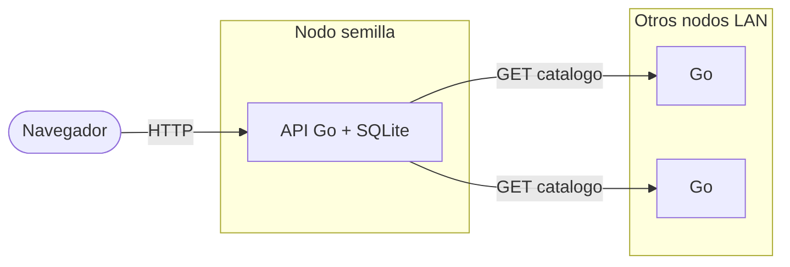

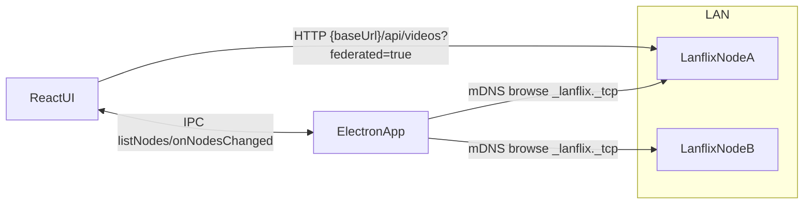

**Docker Compose** (`docker-compose.yml`): servicios `api` (imagen Go) y `web` (nginx + estáticos). Volumen de datos `lanflix-data`; `./sample-media` montado como `/media` de solo lectura para pruebas.

**Legado:** el directorio `backend/` (Spring Boot, PostgreSQL, MinIO, HLS, FFmpeg) conserva la iteración anterior; las secciones siguientes de este documento describen ese diseño y pueden desactualizarse respecto al código activo en `backend-go/` y el frontend actual.

---

## 1. Vista de contexto (iteración Spring + S3 — legado)

Documento histórico: describe cómo se suben objetos a un almacenamiento compatible con **S3**, cómo se guardan metadatos en **PostgreSQL**, cómo se transcodifica a **HLS** (HTTP Live Streaming) con **FFmpeg** en el mismo proceso que expone la **API**, y cómo el **frontend** tipo **SPA** se sirve con **nginx** en producción o con **Vite** en desarrollo.

En esta versión **no hay Redis**: la cola de trabajo es el propio estado en PostgreSQL más un planificador en Spring; la coordinación entre réplicas del API usa **ShedLock** sobre **JDBC** contra una tabla en Postgres, no un broker en memoria.

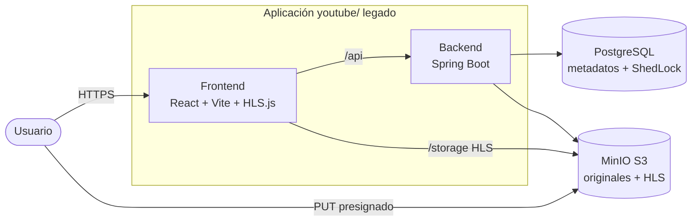

### Decisiones

#### Categoría: Arquitectura front y back (modelo de aplicación)

| Opción | Ventajas | Desventajas |
|--------|----------|-------------|
| **SPA + API REST** | Contrato **HTTP** claro; equipos front y back desacoplados; el contrato del API es fácil de versionar y probar de forma aislada. | Más idas y vueltas de red que un agregador tipo **BFF** (*Backend for Frontend*); el cliente orquesta el flujo (crear → subir → completar). |
| **BFF / GraphQL** | Menos viajes de red; la capa intermedia puede adaptar cargas útiles al UI. | Mayor superficie y acoplamiento entre front y capa intermedia; más riesgo de lógica duplicada o a medio camino respecto al dominio. |
| **UI server-driven (HTMX, etc.)** | Menos JavaScript en el cliente para formularios sencillos. | Poco alineado con reproductor HLS, subidas grandes y estado complejo en el navegador. |
| **Event-driven en el cliente (p. ej. SSE** (*Server-Sent Events*) **/ WebSocket + poco REST)** | El servidor empuja cambios de estado (p. ej. transcode listo) sin sondeo periódico; experiencia más reactiva. | Conexiones largas, tiempos de espera en proxies y **CDN** (*Content Delivery Network*), reconexión y modelo de sesión; más superficie que un modelo puramente petición-respuesta. |

**Decisión final:** SPA (**React** + **Vite**) consumiendo API en estilo REST (véase fila anterior) con cargas en **JSON**.

**Justificación:** Para un **MVP** de video el contrato REST es suficiente y estable; el cliente ya debe gestionar archivos grandes, URL presignadas y sondeo sin que el servidor renderice páginas completas.

#### Categoría: Integración con almacenamiento (contexto)

| Opción | Ventajas | Desventajas |
|--------|----------|-------------|
| **MinIO / API compatible S3** | Mismo modelo que en nubes públicas; **SDK** y patrones (presignación, buckets) reutilizables entre entornos. | Operar MinIO (credenciales, políticas, disco); en desarrollo hay más piezas móviles que un directorio local. |
| **Filesystem local** | Máxima simplicidad en una sola máquina. | Las URL, permisos y despliegue no se parecen a producción; las subidas directas desde el navegador suelen concentrar el tráfico en el API. |
| **Blob propietario del proveedor** | Servicio gestionado con **SLA** (*Service Level Agreement*). | Dependencia fuerte del proveedor en API y herramientas; este repositorio prioriza portabilidad vía compatibilidad S3. |

**Decisión final:** **MinIO** (en Docker) como backend compatible con S3.

**Justificación:** Se mantiene el mismo patrón que en producción (presignación, claves, políticas) sin acoplarse en el código de aplicación a un proveedor concreto.

---

## 2. Despliegue (Docker Compose)

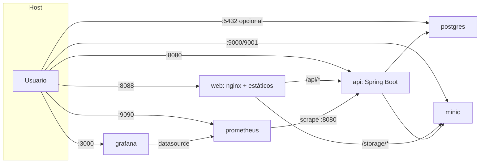

- La variable **`APP_PLAYBACK_BASE_URL`** define el origen desde el que el cliente puede resolver las URL de HLS (p. ej. `http://localhost:8088/storage`) para que `manifestUrl` sea coherente con el proxy de nginx.
- El contenedor **web** no declara dependencia de arranque respecto a MinIO en `depends_on` (el backend sí depende de Postgres); nginx contacta a MinIO por la red interna cuando el usuario solicita segmentos.
- **Prometheus** (time-series metrics; `:9090`) obtiene datos (*scrape*) de `api:8080/actuator/prometheus` en la red Docker. **Grafana** (dashboards and visualization; `:3000`) usa Prometheus como origen de datos mediante *provisioning* (`grafana/provisioning/`) y monta definiciones de tableros en JSON desde `grafana/dashboards/`; el tablero de inicio por defecto apunta a una vista general IOL Video (**JVM**, HTTP, and **Hikari** metrics via job `video-api`).

### Decisiones

#### Categoría: Despliegue y borde (proxy inverso / contenedores)

| Opción | Ventajas | Desventajas |
|--------|----------|-------------|
| **nginx sirviendo estáticos + proxy a API y MinIO** | Un solo origen para la UI, `/api` y `/storage`; compresión gzip; `try_files` para rutas de SPA; menos fricción de **CORS** (*Cross-Origin Resource Sharing*) en HLS. | Hay que mantener `nginx.conf` y la coherencia de rutas con Vite en desarrollo. |
| **Solo Vite `preview` en producción** | Menos archivos de infraestructura. | No es el rol previsto de Vite; peor rendimiento y operación para estáticos y **TLS** delante. |
| **CDN + API Gateway separados** | Escala global y políticas centralizadas en el borde. | Más componentes, coste y complejidad para un MVP. |

**Decisión final:** Imagen Docker del frontend basada en nginx con `location /api/` y `/storage/`.

**Justificación:** Un solo host y puerto para el usuario simplifica la configuración de *playback base URL* y evita abrir CORS en MinIO para los segmentos HLS.

#### Categoría: Base de datos en contenedor

| Opción | Ventajas | Desventajas |
|--------|----------|-------------|
| **PostgreSQL 16 Alpine + healthcheck** | Imagen contenida; `depends_on` con condición de salud para levantar el API cuando la base está lista. | Alpine a veces sorprende con librerías nativas (no es crítico aquí con JDBC puro). |
| **SQLite** | Cero servicio aparte en desarrollo. | Varias instancias del API más ShedLock y bloqueos distribuidos no encajan sin otro mecanismo de coordinación. |
| **Postgres “full” no-Alpine** | Máxima compatibilidad binaria. | Imagen más pesada sin beneficio claro para este alcance. |

**Decisión final:** PostgreSQL 16 Alpine en `docker-compose`.

**Justificación:** El backend ya asume Postgres para **JPA** y para ShedLock; el *healthcheck* reduce fallos de arranque por condiciones de carrera con la API.

#### Categoría: Observabilidad en Compose (opcional local)

| Opción | Ventajas | Desventajas |
|--------|----------|-------------|
| **Prometheus + Grafana junto a la app en `docker-compose`** | Misma red que el API para el scrape; tableros versionados en el repositorio; sin dependencia de SaaS. | Más contenedores y puertos expuestos en el host; no es obligatorio para el flujo de vídeo. |
| **Solo métricas por curl al endpoint** | Cero servicios adicionales. | Sin series históricas ni paneles compartidos. |

**Decisión final:** Servicios `prometheus` y `grafana` en Compose, con configuración y tableros bajo `youtube/prometheus/` y `youtube/grafana/`.

**Justificación:** Demuestra el camino estándar Actuator → Prometheus → Grafana sin añadir lógica en la aplicación más allá del endpoint ya expuesto.

---

## 3. Frontend (`frontend/`)

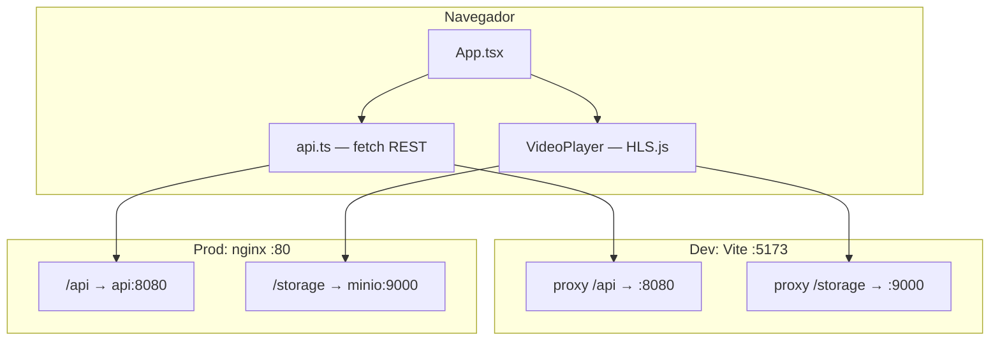

- Flujo de subida: `POST /api/videos` → `PUT` al `uploadUrl` presignado (el tráfico sale del navegador hacia MinIO) → `POST /api/videos/{id}/complete`.
- `uploaderId` se genera en `localStorage` para poder borrar solo los vídeos propios (`DELETE` con parámetro de consulta); no hay sesión en servidor.
- **`GET /api/videos`:** devuelve **todos** los estados, más recientes primero (grilla principal). **`GET /api/videos?readyOnly=true`:** solo **`READY`** (p. ej. si el cliente quiere un catálogo solo reproducibles). En la UI, la columna **Siguientes videos** del detalle filtra a `READY` en cliente; la grilla principal muestra también subidas y procesamiento.
- **Experiencia en detalle:** reproductor con controles propios (reproducción, barra de tiempo, silencio, pantalla completa); en pantalla completa el diseño usa una columna flexible para mantener la barra visible. **Vista previa al pasar el cursor** sobre la miniatura de la tarjeta: un segundo flujo HLS en un vídeo pequeño dentro del *tooltip* (con indicador de carga mientras se resuelve el *seek*; *poster* opcional como respaldo); la subida en curso puede cancelarse con `AbortController` si el usuario elimina el elemento.

### Decisiones

#### Categoría: Arquitectura frontend (red y reproducción)

| Opción | Ventajas | Desventajas |
|--------|----------|-------------|
| **Proxy `/storage` (Vite en desarrollo, nginx en producción)** | Mismo origen que la aplicación para el manifiesto y los `.ts`; el navegador trata HLS como mismo origen (*same-origin*). | El proxy debe reescribir bien la ruta; MinIO queda oculto tras el borde, lo cual es intencional aquí. |
| **CORS abierto en MinIO** | El cliente podría contactar directamente el puerto 9000. | Mayor superficie de configuración y de errores; dos orígenes para cookies o autenticación si se añaden después. |
| **Solo URLs firmadas al bucket** | Control fino de expiración por objeto. | Más lógica en cliente y API; las listas de reproducción deben renovarse o llevar tokens coherentes. |

**Decisión final:** Proxy de `/storage` hacia MinIO (mismo patrón en `vite.config` y `nginx.conf`).

**Justificación:** Es el camino más directo para que **HLS.js** funcione sin conflictos con CORS ni exponer el endpoint S3 en bruto al usuario final.

#### Categoría: Arquitectura frontend (formato de streaming)

| Opción | Ventajas | Desventajas |
|--------|----------|-------------|
| **HLS (.m3u8 + .ts) + HLS.js** | Safari con HLS nativo; en Chrome y Firefox, **MSE** (*Media Source Extensions*) vía HLS.js; bitrate adaptativo con lista maestra (*master playlist*). | Latencia de empaquetado en el servidor (segmentos); no es *live* de baja latencia sin diseño adicional. |
| **DASH** (*Dynamic Adaptive Streaming over HTTP*) | Estándar abierto; buen ecosistema en algunos reproductores. | Otro *pipeline* FFmpeg y otro reproductor; más complejidad para el mismo MVP. |
| **MP4** progresivo único | Implementación mínima en `<video src>`. | Sin **ABR** (*Adaptive Bitrate*) sin lógica adicional; archivos grandes empeoran el *seek* sobre HTTP. |

**Decisión final:** HLS con variantes 480p/720p y **HLS.js** donde no hay soporte nativo.

**Justificación:** El backend ya genera HLS; HLS.js es el estándar de facto para unificar navegadores sin migrar el dominio a DASH.

---

## 4. Backend — capas lógicas

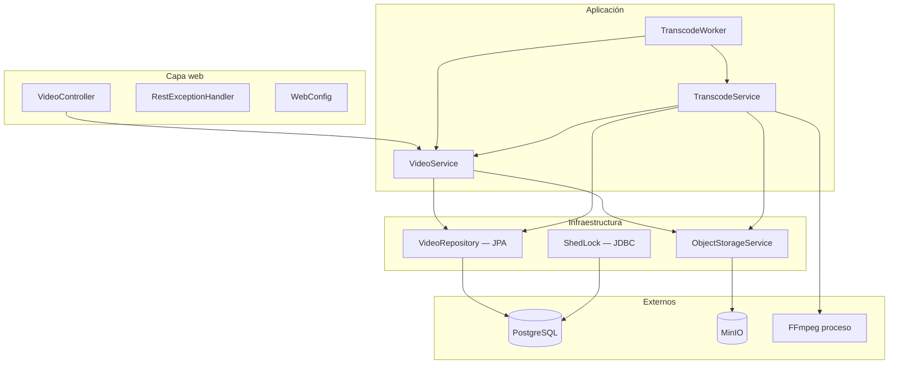

### Decisiones

#### Categoría: Arquitectura backend (descomposición del sistema)

| Opción | Ventajas | Desventajas |
|--------|----------|-------------|
| **Monolito Spring Boot (REST + worker + FFmpeg en un JVM)** | Un artefacto, transacciones locales, planificación sencilla y depuración lineal. | **CPU** y memoria de transcodificación compiten con las peticiones HTTP; escalar horizontalmente duplica también FFmpeg salvo que se deshabilite el worker por configuración. |
| **Microservicios (API frente a “transcoder”)** | Aislamiento de fallos y de escala; despliegues independientes. | Más red, consistencia eventual, más **CI/CD** y observabilidad distribuida. |
| **Event-driven en servidor con broker de mensajes (RabbitMQ, SQS, NATS (*NATS.io*)…)** | Desacople entre comando HTTP y trabajo asíncrono; varios consumidores del mismo evento; encaja con `VideoUploaded` → transcode sin acoplar al API. | Operar el broker en **HA** (*High Availability*); semántica *at-least-once*, idempotencia y trazas distribuidas; más piezas que sondeo más Postgres. |
| **Event-driven en servidor con Apache Kafka** | Registro retenido y **replay**; orden por partición; muy alta escala de ingesta y muchos consumidores; ecosistema (Connect, Schema Registry, *streams*). | **Sobredimensionado** para un MVP de bajo volumen: clúster a operar (KRaft o ZooKeeper en despliegues antiguos), ajuste fino, coste fijo; complejidad de diseño de *topics*, particiones y consumidores idempotentes. |
| **Funciones + cola (serverless)** | Escala por evento; sin servidor que mantener encendido de forma tradicional. | Límites de tiempo y tamaño; arranques en frío; modelo de archivos temporales más delicado. |

**Decisión final:** Monolito Spring Boot con `@Scheduled` y servicios de dominio en el mismo proceso.

**Justificación:** Prioridad al tiempo hasta obtener valor en el MVP: menos operación y menos fronteras entre “crear vídeo” y “procesar vídeo”; un *backbone* Kafka sería posible a futuro pero innecesario mientras el caudal y el equipo de plataforma no lo justifiquen.

#### Categoría: Datos / esquema JPA

| Opción | Ventajas | Desventajas |
|--------|----------|-------------|
| **`ddl-auto: validate`** | Hibernate no altera tablas de forma implícita; el esquema es contrato explícito. | Hay que aplicar migraciones con herramienta aparte (**Flyway** / **Liquibase**) si el esquema crece; hoy el proyecto asume esquema estable. |
| **`update` / `create`** | Arranque rápido en prototipo. | Sorpresas entre entornos; cambios difíciles de revisar en revisión de código. |

**Decisión final:** `validate`.

**Justificación:** Reduce el riesgo de *drift* de esquema entre equipos y encaja con entornos donde la base de datos es compartida o persistente (volumen Docker).

---

## 5. Datos y estados (PostgreSQL)

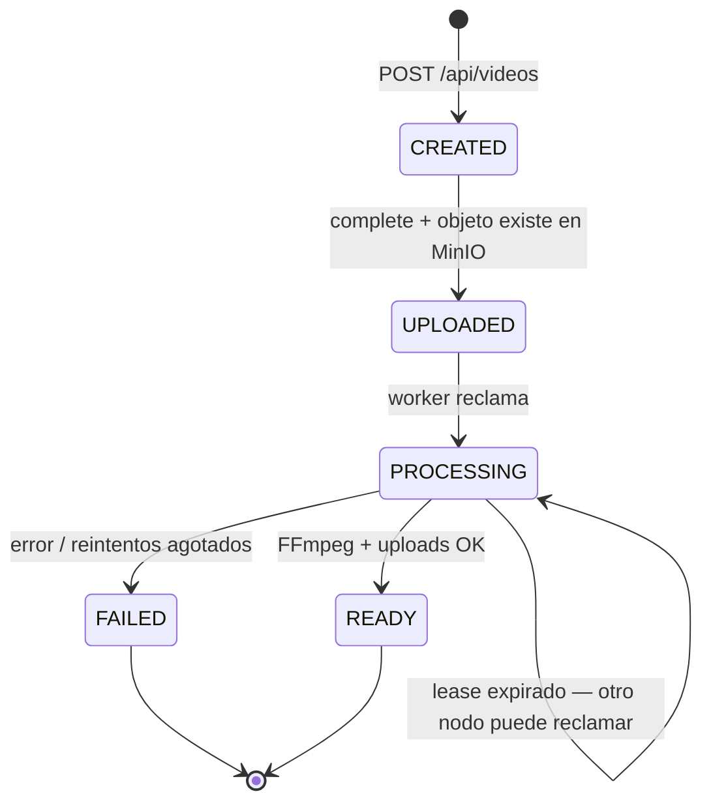

- **`VideoService.list(null)`** / **`GET /api/videos`** incluye todos los estados para la grilla principal; **`list(true)`** / **`?readyOnly=true`** limita a `READY` cuando hace falta (p. ej. listas solo reproducibles).
- Bloqueo **pesimista** al elegir el siguiente `UPLOADED` y al buscar `PROCESSING` obsoleto (*stale lease*) para recuperación.
- **`processing_lease_until`**: evita que dos *workers* procesen el mismo vídeo de forma indefinida; se renueva durante FFmpeg.

### ShedLock (sin Redis)

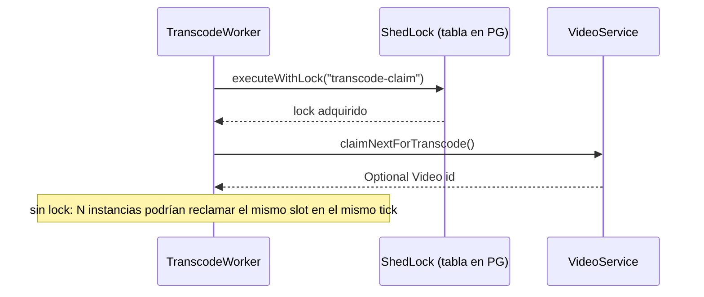

### Decisiones

#### Categoría: Cola de trabajos y asíncronos

| Opción | Ventajas | Desventajas |
|--------|----------|-------------|
| **Estado en tabla `videos` + polling `@Scheduled`** | Sin Redis ni broker; copias de seguridad y consistencia con el mismo Postgres que el dominio. | Menor rendimiento que una cola dedicada; el API y el worker comparten proceso si no se externaliza el worker. |
| **Redis / RabbitMQ / SQS** | Desacople claro productor/consumidor; reintentos y **DLQ** (*Dead Letter Queue*) como patrón consolidado. | Más infraestructura, monitorización y semántica *at-least-once* con idempotencia explícita. |
| **Redis Streams** | Buen equilibrio entre cola y persistencia si ya se opera Redis. | Otro sistema que puede fallar y que hay que versionar; excesivo para pocos vídeos por minuto. |

**Decisión final:** Cola implícita en Postgres (`UPLOADED` → `PROCESSING` → …) con worker programado.

**Justificación:** Menor superficie operativa hasta que el volumen o la necesidad de varios workers especializados lo justifique.

#### Categoría: Coordinación entre réplicas del API

| Opción | Ventajas | Desventajas |
|--------|----------|-------------|
| **ShedLock sobre JDBC (Postgres)** | Reutiliza la base de datos ya obligatoria; **TTL** y nombres de bloqueo gestionados por la librería. | Contención leve en la tabla de bloqueos; dependencia del reloj y de la hora de la base (`usingDbTime()`). |
| **Lock en memoria (singleton)** | Trivial en un solo nodo. | Incorrecto con más de una réplica: doble reclamación del mismo trabajo. |
| **pg_advisory_lock manual** | Control total en SQL. | Reinventar expiración, *heartbeats* y nombres estables; más código propenso a errores. |

**Decisión final:** ShedLock (`transcode-claim`) con `JdbcTemplateLockProvider`.

**Justificación:** Permite escalar el contenedor `api` a N réplicas sin que el mismo ciclo del planificador reclame el mismo vídeo dos veces.

---

## 6. Almacenamiento de objetos (MinIO / S3)

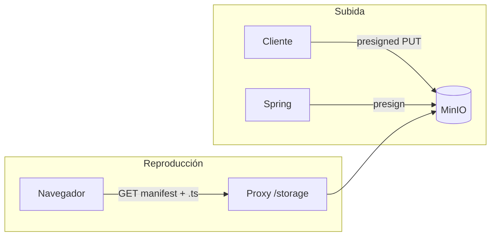

- Claves: `originals/{id}/source`, `transcoded/{id}/...` (*thumbnail*, HLS variants, `master.m3u8`).
- **Resilience4j** (*circuit breaker* and *time limiter*) envuelve las llamadas a MinIO en `ObjectStorageService`.
- Política de lectura pública en el prefijo `transcoded/*` (documentada en README; aplicación al arranque en código de configuración de MinIO).

### Decisiones

#### Categoría: Almacenamiento de objetos (subida)

| Opción | Ventajas | Desventajas |
|--------|----------|-------------|
| **PUT presignado directo al bucket** | El binario grande no atraviesa Spring; menos **RAM** y tiempos de espera en el servidor de aplicación. | Menos visibilidad byte a byte en el API; hay que confiar en `complete` y `stat` en MinIO. |
| **Multipart upload vía API** | Políticas y antivirus centralizados en un solo salto. | Cuello de botella y límites de cuerpo en el proxy; más coste de CPU y memoria en el API. |

**Decisión final:** `PUT` presignado generado en `ObjectStorageService` / cliente MinIO.

**Justificación:** Encaja con tamaños de hasta ~1 GB configurados sin dimensionar la JVM para *buffers* enormes.

#### Categoría: Almacenamiento de objetos (URLs de reproducción)

| Opción | Ventajas | Desventajas |
|--------|----------|-------------|
| **`app.playback-base-url` / env `APP_PLAYBACK_BASE_URL`** | URLs absolutas en respuestas alineadas al proxy público (8088 frente a 5173 u otro). | Configuración adicional fácil de olvidar al cambiar puertos. |
| **Solo rutas relativas en playlists** | Menos configuración en backend. | El reproductor y el origen del manifiesto deben acordar la URL base; más acoplamiento a cómo se sirve el `.m3u8`. |

**Decisión final:** URL base configurable inyectada al construir **DTO** y listas de reproducción según entorno.

**Justificación:** Docker, Vite y nginx no comparten el mismo host y puerto; una variable evita fijar el origen público en código.

---

## 7. Transcodificación (FFmpeg + worker)

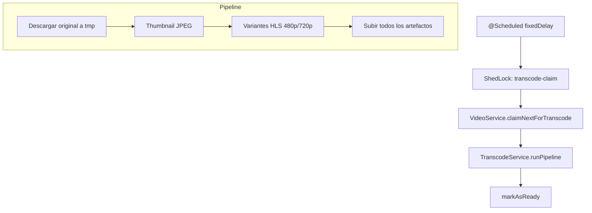

- FFmpeg se invoca como subproceso; tiempos de espera configurables en `application.yml`.
- **Aceleración GPU (NVENC):** al arranque, `FfmpegCapabilities` comprueba que `ffmpeg -encoders` incluya `h264_nvenc` y ejecuta una codificación mínima de prueba (`lavfi` → `h264_nvenc`). Si tiene éxito y `app.ffmpeg.hardware-accel` no es `none`, las variantes HLS usan **h264_nvenc**; si no, **libx264**. Valores: `auto` (por defecto), `none`, `nvenc` (preferir NVENC y degradar a *software* si no es usable).
- **No** es HLS en vivo (*live*): el estado pasa a `READY` cuando terminó todo el *pipeline* (véase README).

### Decisiones

#### Categoría: Transcodificación (motor)

| Opción | Ventajas | Desventajas |
|--------|----------|-------------|
| **FFmpeg en proceso (subproceso)** | Control total de variantes HLS, códecs y filtros; herramienta ampliamente documentada. | Hay que gestionar tiempos de espera, disco temporal y seguridad del comando. |
| **Servicio gestionado (p. ej. MediaConvert, Mux)** | Menos operaciones y escalado elástico del cómputo pesado. | Coste recurrente y acoplamiento al modelo del proveedor. |

**Decisión final:** FFmpeg invocado desde `TranscodeService`.

**Justificación:** Máxima portabilidad entre entornos (solo requiere el binario en `PATH` o en la imagen Docker).

#### Categoría: Transcodificación (ubicación del worker)

| Opción | Ventajas | Desventajas |
|--------|----------|-------------|
| **Worker en el mismo proceso que el REST** | Un despliegue; planificación nativa de Spring. | Picos de transcodificación degradan la latencia del API si comparten CPU. |
| **Proceso o servicio worker dedicado** | Aislamiento de recursos y escala independiente. | Más artefactos, redes y despliegues. |

**Decisión final:** `TranscodeWorker` en el mismo Spring Boot que `VideoController`.

**Justificación:** MVP con baja concurrencia; el arrendamiento más ShedLock ya dejan abierto extraer el worker después.

#### Categoría: Transcodificación (reintentos)

| Opción | Ventajas | Desventajas |
|--------|----------|-------------|
| **Reintentos con retroceso exponencial en el worker** | Absorbe fallos transitorios (red, MinIO). | La re-ejecución puede dejar objetos parciales si no hay limpieza de prefijo; hace falta disciplina en idempotencia. |
| **Fallar en el primer error** | Estado simple. | Menor tasa de éxito en redes ruidosas. |

**Decisión final:** Reintentos configurables (`app.transcode.max-retries`) con espera creciente.

**Justificación:** La subida de muchos segmentos pequeños amplifica la probabilidad de fallo puntual sin que sea un error permanente del vídeo.

---

## 8. Observabilidad y resiliencia

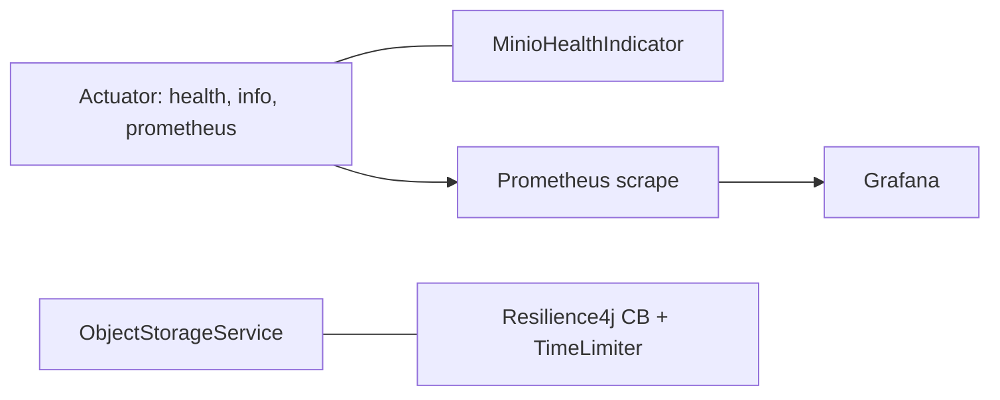

En **Docker Compose**, Prometheus obtiene series desde el job `video-api` (`/actuator/prometheus`); Grafana se configura mediante archivos en `grafana/provisioning/` (*default Prometheus datasource*, dashboard folder) y lee definiciones JSON en `grafana/dashboards/` (includes overview and Spring, JVM, and **Hikari** panels per **Micrometer** metrics; embedded server is **Tomcat**, aligned with exposed `tomcat_*` and `http_server_*` series).

### Decisiones

#### Categoría: Observabilidad y resiliencia (métricas)

| Opción | Ventajas | Desventajas |
|--------|----------|-------------|
| **Spring Boot Actuator + Micrometer Prometheus** | Formato y nombres conocidos; integración con Grafana sin código personalizado. | El endpoint debe protegerse en producción (hoy asume red de confianza). |
| **Métricas solo por logs** | Sin endpoints adicionales. | Difícil alertar y agregar; *parsing* costoso. |

**Decisión final:** Exponer `/actuator/prometheus` junto con `health` e `info`.

**Justificación:** Costo bajo de implementación y camino estándar cuando el despliegue madure.

#### Categoría: Observabilidad y resiliencia (Prometheus y Grafana en el entorno demo)

| Opción | Ventajas | Desventajas |
|--------|----------|-------------|
| **Scrape Prometheus + UI Grafana provisionada** | Tableros reproducibles desde el repositorio; misma red Docker que el API. | Hay que mantener JSON de tableros y `prometheus.yml` al cambiar métricas o puertos. |
| **Solo el endpoint de métricas sin stack** | Menos piezas móviles. | Sin gráficos ni alertas sin herramientas externas. |

**Decisión final:** Incluir Prometheus y Grafana en `docker-compose` con *scrape* al API y tableros versionados bajo `youtube/grafana/` y `youtube/prometheus/`.

**Justificación:** El diseño ya centraliza la telemetría en Micrometer; añadir el par *scrape* / interfaz cierra el circuito de observabilidad para desarrollo y demostraciones sin código adicional en Spring.

#### Categoría: Observabilidad y resiliencia (salud y dependencias)

| Opción | Ventajas | Desventajas |
|--------|----------|-------------|
| **Health que incluye JDBC y MinIO** | Un solo chequeo refleja si el flujo completo puede atenderse. | Un MinIO lento puede marcar como no listo todo el *pod*; a veces se prefiere degradar solo las subidas. |
| **Liveness mínimo + readiness granular** | Evita reinicios innecesarios; **Kubernetes** distingue “vivo” frente a “listo para tráfico”. | Más endpoints o más configuración en `management.health`. |

**Decisión final:** *Health* agregado con indicador MinIO (desactivable en pruebas).

**Justificación:** MVP con pocos servicios; la simplicidad de “todo o nada” en salud es aceptable hasta tener **SLO** (*Service Level Objective*) por componente.

#### Categoría: Resiliencia en llamadas a MinIO

| Opción | Ventajas | Desventajas |
|--------|----------|-------------|
| **Resilience4j (circuit breaker + time limiter)** | Protege el hilo de aplicación de bloquearse ante MinIO degradado. | Ajustar mal los umbrales puede oscilar entre demasiado sensible y ocultar fallos. |
| **Llamadas directas sin protección** | Menos dependencias conceptuales. | Un MinIO lento propaga bloqueos y agota *pools* de conexiones. |

**Decisión final:** `ObjectStorageService` ejecuta operaciones MinIO bajo **CB** (*circuit breaker*) y *time limiter* configurados en YAML.

**Justificación:** El transcode realiza muchas escrituras; sin cortafuegos el proceso queda expuesto a un vecino lento.

---

## 9. Seguridad (alcance actual)

- Sin autenticación de usuarios finales: `uploaderId` es una cadena opaca en parámetro de consulta.
- URL presignadas con **TTL** acotado (`app.presign-ttl-seconds`).

### Decisiones

#### Categoría: Seguridad e identidad

| Opción | Ventajas | Desventajas |
|--------|----------|-------------|
| **Sin autenticación de usuario; `uploaderId` opaco en cliente + parámetro de consulta** | Implementación mínima; desbloquea subida y borrado “por sesión”. | Cualquiera que adivine **UUID** e identificador puede borrar; no hay auditoría fuerte. |
| **OAuth 2.0** / **OpenID Connect** (*OIDC*) | Identidad real, revocación, roles (p. ej. vía proveedor externo). | Más flujos, tokens, *middleware* y superficie en front y back. |
| **Vendor login separados** (un proveedor de identidad por integración: p. ej. Google, GitHub, Apple como flujos y credenciales distintas) | Solo se incorporan los proveedores necesarios; menos dependencia de una única plataforma intermedia. | Varios SDKs, secretos y flujos que mantener; unificación del usuario (*account linking*) y políticas por proveedor. |
| **Vendor login vía Supabase** ([Supabase Auth](https://supabase.com/docs/guides/auth)) | Auth gestionado (correo, enlaces, proveedores sociales); SDKs de cliente y validación de *JWT* en backend; encaja con Postgres si el producto ya usa Supabase. | Dependencia del proveedor; límites y coste según plan; el API debe confiar explícitamente en emisores y *claims* del token. |
| **JWT** (*JSON Web Token*) | Autenticación *stateless* en el API; encaja con cabecera `Authorization` y clientes SPA o móviles; los *claims* pueden expresar identidad y alcance sin sesión en servidor. | Hay que diseñar el flujo de registro y validación por correo (y recuperación de contraseña si aplica); revocación y rotación exigen diseño (*refresh tokens*, *denylist*, rotación de claves); hay que evitar algoritmos o claves débiles y no poner datos sensibles en el *payload* sin cifrar. |
| **API keys por integración** | Simple para integración servidor a servidor. | Poco adecuado para una UI de navegador sin otro mecanismo. |

**Decisión final:** MVP sin autenticación en servidor; `localStorage` + `uploaderId` en `DELETE`.

**Justificación:** El alcance actual es demostrar el *pipeline* de vídeo; la seguridad de producto se deja explícitamente para una iteración posterior.

---

## 10. Resumen: Redis y otras piezas ausentes

| Componente | Estado en el repositorio | Si se añadiera |
|------------|--------------------------|----------------|
| **Redis** | No usado | Caché de listados, límite de tasa, cola de trabajos, *pub/sub* de progreso; coste: otro servicio en HA y consistencia con la base de datos. |
| **Message broker** | No usado | Desacoplar transcode del API; coste: entrega *at-least-once*, idempotencia, *dead-letter*. |
| **CDN** | No | Menor latencia HLS a escala global; coste: invalidación y configuración de orígenes. |

---

## 11. Uso de IA en este trabajo

La **IA**, en concreto el asistente en Cursor, se usó como **apoyo en análisis, síntesis y codificación**, no como sustituto del criterio de diseño ni de la validación final.

1. **Libro sugerido y criterios de calidad**  
   Se incorporó el **EPUB** (*electronic publication*) del libro recomendado para obtener un **resumen de aprendizajes clave** aplicables a este proyecto; esa síntesis se volcó en **reglas persistentes de Cursor** (p. ej. filosofía de diseño y estándares de entrega). En paralelo se tomaron **varios puntos del PDF del challenge** enviado como restricciones y lista de comprobación de alcance.

2. **Del PDF del challenge a requisitos**
   Las páginas del **PDF** correspondientes al **challenge elegido** se **descompusieron en requisitos funcionales y de arquitectura** (flujos, límites del sistema, supuestos de despliegue), de modo que el diseño del repositorio quedara alineado al enunciado y no solo a la intuición.

3. **Cruce libro + challenge → decisiones técnicas**  
   Entre el material del libro y el del challenge se **identificaron decisiones clave**: implementación concreta, **tecnologías, herramientas, librerías, lenguajes** y **arquitectura** (muchas de ellas reflejadas en las secciones anteriores de este `DESIGN.md`).

4. **Plan, implementación y revisiones**  
   Con esas decisiones cerradas, se solicitó en Cursor **armar un plan de implementación**; se **ajustaron puntos del plan** según prioridades y riesgos. Tras la **implementación asistida por IA** se **revisó el resultado funcional** y la **calidad del código** (contratos, errores, pruebas, complejidad innecesaria). Luego se **iteró** sobre **UX**, **observabilidad** y otros refinamientos.

La responsabilidad de las decisiones finales y de la coherencia del entregable sigue siendo humana; la IA aceleró redacción, exploración de alternativas y volumen de código revisable.
